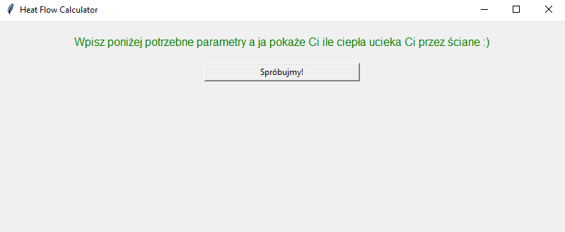

# Heat Calculator

Program is in Polish language, translation below:

➣ Enter the required materials below and I will show you how much heat escapes through the wall :)

➣ Button: Let’s try it!

➣ Types of materials to choose from:

➣ Solid brick, half-timbered brick, perforated brick, ceramic hollow stone

➣ Enter the type of material:

➣ If you enter the wrong material, the label will appear

➣ Wrong material, please try again :)  

➣ Types of materials to choose from:

➣ mineral wool, Styrofoam

➣ Enter the type of inner material  

➣ Enter the outside temperature [℃ ]

➣ Enter the temperature in the room [℃ ]

➣ Enter the thickness of the wall [m]

➣ The last step is yet!

➣ Enter the size of your wall in [㎡]

➣ We know everything!

➣ It escapes you 17.88 [W] heat...

